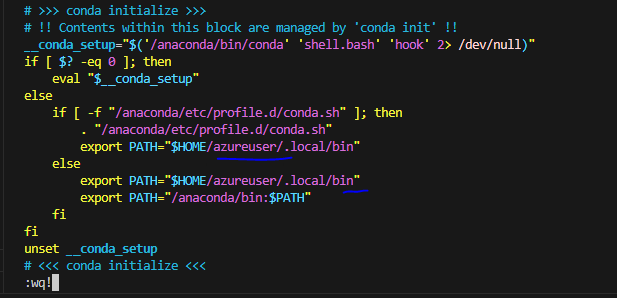

# Introduction
This repository contains examples of using Polars and Deltalake directly against ADLSGen2 Storage. For maximum reproducibility they use the base interfaces of azure storage and minimal dependencies are added (no AzureML Data).

The repository uses poetry to manages dependencies instead of pip. Poetry offers a much richer configuration environment files via pyproject.tml and poetry.lock. Unlike pip, poetry.lock locks the dependencies at binary level and in a hasheable format, ensuring even better reproducibility. Besides it allow us to combine nicely with pre-commit hooks and linting tools like ruff or pylint.

# Getting Started

To get started you should perform the following steps:

1.	Installation of poetry:
    - Ensure you have a python installation (higher than 3.8+) in your system (via miniconda3, anaconda3 or a vanilla one from python.org)
    - Run the following command in a linux computer or in WSL (Windows Subsystem for Linux):

    ```{bash}
    curl -sSL https://install.python-poetry.org | python3 -
    ```
    - This will install poetry in the current python environment that you have active. Poetry needs to be separated always from your project environment. If you are using conda or miniconda for your python installation you can install poetry in your base environment. However please ensure that your base environment is clean and only contains minimal dependencies.
2.	Configuring poetry:
    - Sometimes (specially if you have conda) poetry PATH variable can be overwritten when you run ```conda init bash```.
    - Sometimes your system will not recognize the path of poetry (this happens specially in AzureML instances) and you might need to add to your ./home/user/.bashrc file an environment variable specifying the location of poetry. More details are available [here](https://python-poetry.org/docs/#installing-with-the-official-installer).
    - If you are in azureML instances please edit your /home/azureuser/.bashrc and add the following path variable and restart your bash shell:
    
    - Finally overwrite the global configuration of poetry to always use virtual environments in every project with ```poetry config virtualenvs.in-project true```
3.	After you have installed poetry successfully you can now clone these repository with ```git clone git@github.com:edgBR/delta-lake-polars.git```. Ensure you have a valid [SSH Key](https://docs.github.com/en/authentication/connecting-to-github-with-ssh/adding-a-new-ssh-key-to-your-github-account).
4. Finally execute the following ```poetry install```.

# Build and Test

To run the project:

```{bash}
cd code
poetry run python -m minimal_local
```

And this should output the following result:

```{python}
shape: (4, 5)
┌────────────────┬────────────┬─────────────────────┬─────────────┬──────────────────┐
│ sales_order_id ┆ product    ┆ order_date          ┆ sales_price ┆ paid_by_customer │
│ ---            ┆ ---        ┆ ---                 ┆ ---         ┆ ---              │
│ str            ┆ str        ┆ datetime[μs]        ┆ f64         ┆ bool             │
╞════════════════╪════════════╪═════════════════════╪═════════════╪══════════════════╡
│ 1000           ┆ bike       ┆ 2023-01-01 00:00:00 ┆ 120.25      ┆ true             │
│ 1001           ┆ scooter    ┆ 2023-01-05 00:00:00 ┆ 2400.0      ┆ false            │
│ 1002           ┆ car        ┆ 2023-01-10 00:00:00 ┆ 32000.0     ┆ false            │
│ 1003           ┆ motorcycle ┆ 2023-02-01 00:00:00 ┆ 9000.0      ┆ true             │
```
To run the [poor man's datalake demo](https://www.edgarbahilo.com/poor-mans-data-lake-with-polars-deltalake/) run:
```{bash}
cd code
poetry run python -m main
```
